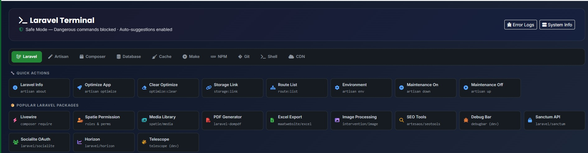
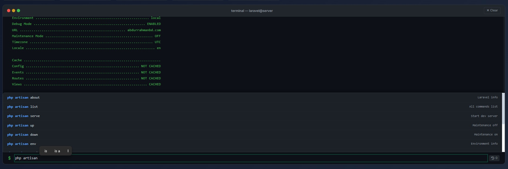

# Laravel Terminal

A powerful web-based terminal for Laravel applications. Execute artisan commands, manage packages, run shell commands, and more — all from your browser.

  

## Screenshots





## Features

- **Laravel Artisan** — Run any artisan command with one click
- **Composer & NPM** — Install/remove packages, run builds
- **Database** — Migrations, seeders, DB info
- **Git** — Status, log, branches, push/pull
- **Cache Management** — Clear/build all caches
- **Make Commands** — Generate controllers, models, migrations, etc.
- **Shell Commands** — ls, pwd, df, free, uname, and more
- **CDN Library** — Copy CDN links for Alpine, Vue, Tailwind, Bootstrap, etc.
- **Error Logs Viewer** — Browse, search, and clear Laravel error logs
- **Auto-suggestions** — Type and get instant command suggestions
- **Command History** — Navigate with arrow keys
- **Safe Mode** — Dangerous commands are blocked by default

## Requirements

- PHP 8.1+
- Laravel 10, 11, or 12

## Installation

### Step 1: Add the GitHub repository to your `composer.json`

Add this to your project's `composer.json`:

```json
{
    "repositories": [
        {
            "type": "vcs",
            "url": "https://github.com/abdurrahman-eee/laravel-terminal"
        }
    ]
}
```

### Step 2: Install the package

```bash
composer require abdurrahman/laravel-terminal
```

Laravel will auto-discover the service provider. No manual registration needed.

### Step 3: Publish the config (optional)

Publish the config file to customize settings:

```bash
php artisan vendor:publish --tag=terminal-config
```

### Step 4: Publish the views (optional)

Publish the views if you want to customize the terminal UI:

```bash
php artisan vendor:publish --tag=terminal-views
```

### Step 5: Visit the terminal

Open your browser and go to:

```
https://yoursite.com/terminal
```

That's it! 🎉

### Alternative: Local path installation

If you prefer to keep the package inside your project:

1. Copy the package folder to `packages/abdurrahman/laravel-terminal/`
2. Add this to your `composer.json`:

```json
{
    "repositories": [
        {
            "type": "path",
            "url": "packages/abdurrahman/laravel-terminal"
        }
    ]
}
```

3. Run `composer require abdurrahman/laravel-terminal`

## Configuration

After publishing, edit `config/terminal.php`:

```php
return [
    // URL prefix (e.g., /terminal, /admin/terminal)
    'prefix' => 'terminal',

    // Middleware applied to all terminal routes
    'middleware' => ['web', 'auth'],

    // Blade layout to extend
    'layout' => 'layouts.admin',

    // Commands that are blocked for security
    'blocked_commands' => [
        'rm -rf', 'mkfs', 'dd if=', ':(){', 'chmod -R 777',
        'wget', '> /dev/sda', 'shutdown', 'reboot', 'init 0',
        'init 6', 'kill -9', 'killall', 'format', 'fdisk',
        'passwd', 'useradd', 'userdel', 'visudo', 'crontab -r',
    ],

    // Allowed artisan commands
    'allowed_artisan_commands' => [
        'list', 'about', 'env', 'up', 'down', 'optimize',
        'optimize:clear', 'key:generate', 'storage:link',
        'cache:clear', 'config:clear', 'config:cache',
        'route:clear', 'route:cache', 'route:list',
        'view:clear', 'view:cache', 'event:clear', 'event:cache',
        'event:list', 'migrate', 'migrate:status', 'migrate:rollback',
        'migrate:reset', 'migrate:fresh', 'db:seed', 'db:show', 'db:table',
        'schedule:list', 'schedule:run', 'queue:work', 'queue:retry',
        'queue:flush', 'queue:listen', 'vendor:publish',
        'config:show', 'make:controller', 'make:model', 'make:migration',
        'make:middleware', 'make:request', 'make:seeder', 'make:factory',
        'make:command', 'make:mail', 'make:notification', 'make:event',
        'make:listener', 'make:job', 'make:policy', 'make:resource',
        'make:component', 'make:livewire', 'make:test', 'make:rule',
        'make:observer', 'make:scope', 'make:cast', 'make:enum',
        'make:exception',
    ],

    // Command execution timeout in seconds
    'timeout' => 300,
];
```

## Usage

Visit `https://yoursite.com/terminal` (or your configured prefix) in your browser.

## Routes

| Method | URI | Name |
|--------|-----|------|
| GET | /terminal | terminal.index |
| POST | /terminal/execute | terminal.execute |
| POST | /terminal/execute-interactive | terminal.execute-interactive |
| GET | /terminal/system-info | terminal.system-info |
| GET | /terminal/error-logs | terminal.error-logs |
| GET | /terminal/get-error-logs | terminal.get-error-logs |
| POST | /terminal/clear-logs | terminal.clear-logs |
| GET | /terminal/download-logs | terminal.download-logs |
| GET | /terminal/diagnose-npm | terminal.diagnose-npm |
| GET | /terminal/diagnose-composer | terminal.diagnose-composer |
| GET | /terminal/node-modules-list | terminal.node-modules-list |

## Security

- All routes are protected by configurable middleware (default: `web`, `auth`)
- Dangerous commands (rm -rf, shutdown, etc.) are blocked
- Only whitelisted artisan commands can be executed
- Configure `blocked_commands` and `allowed_*_commands` in config

> ⚠️ **Warning**: This package gives browser-based shell access. Always protect it with authentication middleware and never expose it publicly without auth.

## Uninstall

```bash
composer remove abdurrahman/laravel-terminal
```

Optionally remove published files:
```bash
rm config/terminal.php
rm -rf resources/views/vendor/terminal
```

## Author

**Abdur Rahman**
- GitHub: [@abdurrahman-eee](https://github.com/abdurrahman-eee)
- Website: [abdurrahmanbd.com](https://abdurrahmanbd.com)

## License

MIT — see [LICENSE](LICENSE) for details.
